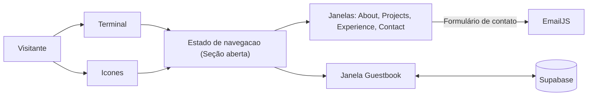

# 💻 Leonardo Pettersen | Portfólio Profissional

> Portfólio profissional em formato de **desktop interativo com terminal**: o visitante navega pelas seções digitando comandos ou clicando nos ícones.


🚧 **Status:** Sprint 01, planejamento e prototipação.

---

## 📚 Índice

- [Links Úteis](#-links-úteis)
- [Sobre o Projeto](#-sobre-o-projeto)
- [Funcionalidades Principais](#-funcionalidades-principais)
- [Tecnologias Utilizadas](#-tecnologias-utilizadas)
- [Arquitetura](#-arquitetura)
- [Instalação e Execução](#-instalação-e-execução)
- [Deploy](#-deploy)
- [Estrutura de Pastas](#-estrutura-de-pastas)
- [Demonstração](#-demonstração)
- [Documentações utilizadas](#-documentações-utilizadas)
- [Autor](#-autor)
- [Agradecimentos](#-agradecimentos)
- [Licença](#-licença)

---

## 🔗 Links Úteis

* 🌐 **Site publicado:** disponível na Sprint 03.
* 🎨 **Protótipos no Figma:** [Wireframe Portfólio](https://www.figma.com/design/RagNM3PaJglaInWaZBa3Uk/Wireframe-Portif%C3%B3lio?node-id=0-1&t=LONNOAM8aQx4MY8Z-1)

---

## 📝 Sobre o Projeto

Este projeto é o meu portfólio profissional: um site onde reúno minha trajetória, projetos, experiências e formas de contato em um só lugar. Foi desenvolvido como o **Laboratório 01** da disciplina de Desenvolvimento e Integração de Aplicações Web (DIAW), do curso de Engenharia de Software da PUC Minas, e continua como meu portfólio de fato depois da entrega.

Em vez de um site tradicional com menu e rolagem, a interface imita um **desktop com terminal**. O visitante pode explorar o conteúdo de dois jeitos: digitando comandos (`about`, `projects`, `experience`, `contact` e `help`) ou clicando nos ícones da tela. Nos dois casos o resultado é o mesmo: a seção abre em uma janela sobre o desktop.

A ideia é que quem chega entenda em poucos segundos quem eu sou, veja meus projetos e experiências e consiga entrar em contato. O site é bilíngue (português e inglês), tem tema claro e escuro e se adapta a telas de computador e de celular.

O site é aberto a qualquer pessoa: basta entrar para conhecer meus projetos e experiências e, se fizer sentido, usar o formulário ou os links de contato para falar comigo. Por isso o foco está em ser claro, rápido de navegar e fácil de contatar, sem exigir cadastro nem login.

---

## ✨ Funcionalidades Principais

- 🖥️ **Desktop interativo:** interface em formato de área de trabalho, com janelas para cada seção.
- ⌨️ **Terminal com comandos:** navegação por `about`, `projects`, `experience`, `contact` e `help`, com atalhos clicáveis na tela.
- 🖱️ **Navegação por ícones:** as mesmas seções acessíveis com cliques, tanto no desktop quanto no celular.
- 🌐 **Bilíngue (PT/EN):** conteúdo em português e inglês, com alternância na barra superior.
- 🌓 **Tema claro e escuro:** alternância pela barra superior.
- 🕒 **Timeline de projetos:** projetos em ordem cronológica, com descrição, tecnologias, link do GitHub e imagem ou GIF.
- 💼 **Experiências:** lista organizada com organização, cargo, período e descrição.
- 📨 **Formulário de contato:** nome, e-mail e mensagem, com validação e envio por e-mail via EmailJS.
- 🔗 **Links de contato:** ícones clicáveis para e-mail, WhatsApp, LinkedIn e GitHub.
- 💬 **Guestbook:** quem digitar `help` no terminal descobre o comando `guestbook`, onde é possível deixar uma mensagem pública e ler as de outros visitantes. As mensagens ficam armazenadas no Supabase.
- 📱 **Responsivo:** adaptado a telas de computador e de celular.

---

## 🛠 Tecnologias Utilizadas

As principais ferramentas, frameworks e bibliotecas do projeto. As versões exatas estão no `package.json`.

### 💻 Front-end

* **Biblioteca:** [React](https://react.dev/)
* **Linguagem:** [TypeScript](https://www.typescriptlang.org/)
* **Build Tool:** [Vite](https://vite.dev/)
* **Estilização:** [Tailwind CSS](https://tailwindcss.com/)
* **Internacionalização (PT/EN):** [react-i18next](https://react.i18next.com/)

### 🗄️ Dados e Serviços

O projeto não tem back-end próprio. Os serviços externos são:

* **Banco de dados (guestbook):** [Supabase](https://supabase.com/)
* **Envio de e-mail (formulário de contato):** [EmailJS](https://www.emailjs.com/)

### ⚙️ Infraestrutura e Ferramentas

* **Containerização (execução local):** [Docker](https://www.docker.com/)
* **Hospedagem:** [Vercel](https://vercel.com/)
* **Protótipos:** [Figma](https://www.figma.com/)
* **Versionamento:** [Git](https://git-scm.com/) e [GitHub](https://github.com/)

---

## 🏗 Arquitetura

### Visão geral

O projeto é uma **SPA (Single Page Application)** em React e TypeScript, construída com Vite e publicada na Vercel. Não há back-end próprio: os dois recursos que dependem de serviço externo, o guestbook e o envio de e-mail, são chamados diretamente pelo front-end, usando Supabase e EmailJS.

### Principais componentes

- **Desktop e barra superior:** área de trabalho com os ícones das seções, alternância de idioma (PT/EN), de tema (claro/escuro) e relógio.
- **Terminal:** interpreta os comandos digitados e leva o visitante à seção correspondente.
- **Janelas:** uma para cada seção (About, Projects, Experience, Contact) e uma para o guestbook.
- **Dados de projetos e experiências:** ficam em arquivos do próprio código e alimentam a timeline e a lista de experiências.
- **Guestbook:** mensagens armazenadas e lidas no Supabase.
- **Formulário de contato:** envia o e-mail pelo EmailJS.

### Fluxo de navegação

Não há roteamento por URL: o site inteiro vive em uma única tela e a navegação é controlada por um **estado local do React**. O componente do desktop guarda qual seção está aberta no momento (ou nenhuma). Quando nenhuma seção está aberta, o terminal fica visível; quando há uma seção aberta, a janela correspondente é exibida sobre o desktop.

Terminal e ícones não têm lógicas separadas: os dois alteram o **mesmo estado**. Digitar `projects` ou clicar no ícone de Projects tem o mesmo efeito, e a janela de Projects abre. Fechar a janela limpa o estado e devolve o terminal. O comando `guestbook` segue o mesmo caminho, mas não aparece nos ícones nem nos atalhos: só é listado na saída do `help`.

A lista de seções (usada tanto nos ícones quanto nos comandos do terminal) fica centralizada em um único arquivo de dados, de modo que adicionar uma seção nova significa registrá-la nesse ponto e nos tipos do projeto.

### Decisões arquiteturais

- **Sem back-end próprio:** o site só precisa de um banco para o guestbook e de envio de e-mail, e ambos são cobertos por serviços prontos.
- **Navegação por estado local, sem biblioteca de rotas:** o site é uma tela única com janelas sobrepostas, então não há páginas distintas que justifiquem um roteador. Isso mantém o projeto mais simples e com menos dependências.
- **Conteúdo fixo no código:** projetos e experiências mudam pouco, então ficam versionados junto ao projeto, sem depender de banco.
- **Guestbook com publicação imediata:** a mensagem aparece assim que é enviada, com limites para evitar spam. O conteúdo inadequado é removido manualmente.
- **Chaves públicas no front-end:** as chaves do Supabase e do EmailJS ficam no cliente por natureza, então a proteção do guestbook vem das regras de acesso configuradas no Supabase, e não de esconder a chave.
- **Docker só para execução local:** a Vercel faz o build e o deploy do site sem containers.

### Trade-offs

- Como não há rotas, cada seção não tem URL própria: não é possível compartilhar um link direto para Projects, e o botão voltar do navegador não fecha janelas.
- Atualizar um projeto ou experiência exige um novo deploy.
- A moderação do guestbook é manual.
- Sem back-end próprio, regras mais elaboradas (como limite de envios por visitante) ficam restritas ao que o Supabase permite configurar.

### Diagrama



---

## 🔧 Instalação e Execução

### Pré-requisitos

* **Git**
* **Docker** com **Docker Compose** (recomendado para rodar o projeto)
* **Node.js** (versão LTS), só se quiser rodar sem Docker
* Contas gratuitas no **Supabase** e no **EmailJS**, para obter as chaves usadas nas variáveis de ambiente

### 📦 Instalação

```bash
git clone https://github.com/leopettersen/portifolio.git
cd portifolio
```

### 🔑 Variáveis de Ambiente

O projeto fica na pasta `app/`. A partir da raiz do repositório, copie o arquivo de exemplo e preencha com os seus valores:

```bash
cp app/.env.example app/.env
```

| Variável | Descrição |
| :--- | :--- |
| `VITE_SUPABASE_URL` | URL do projeto no Supabase. |
| `VITE_SUPABASE_ANON_KEY` | Chave pública (anon/publishable) do Supabase. |
| `VITE_EMAILJS_SERVICE_ID` | ID do serviço de e-mail no EmailJS. |
| `VITE_EMAILJS_TEMPLATE_ID` | ID do template de e-mail no EmailJS. |
| `VITE_EMAILJS_PUBLIC_KEY` | Chave pública do EmailJS. |

> [!IMPORTANT]
> O arquivo `.env` não é versionado. Use apenas chaves **públicas** nas variáveis `VITE_*`, porque o Vite as inclui no código entregue ao navegador.

### ⚡ Como Executar

**Com Docker (recomendado), a partir da raiz do repositório:**

```bash
docker compose up --build
```

O site ficará disponível em **http://localhost:5173**, com recarga automática ao editar o código.

Para parar:

```bash
docker compose down
```

**Sem Docker:**

```bash
cd app
npm install
npm run dev
```

### 💾 Banco de Dados (Guestbook)

As instruções para criar a tabela de mensagens no Supabase serão adicionadas na Sprint 02.

---

## 🚀 Deploy

> [!NOTE]
> O deploy está previsto para a Sprint 03. As instruções abaixo descrevem a configuração planejada.

O site é publicado na **Vercel**, conectada ao repositório do GitHub. Cada atualização na branch principal gera um novo deploy automaticamente.

Configuração do projeto na Vercel:

| Campo | Valor |
| :--- | :--- |
| Framework Preset | Vite |
| Root Directory | `app` |
| Build Command | `npm run build` |
| Output Directory | `dist` |

As variáveis de ambiente (`VITE_*`, listadas em [Instalação e Execução](#-instalação-e-execução)) devem ser cadastradas no painel da Vercel, em *Project Settings > Environment Variables*, antes do build.

---

## 📂 Estrutura de Pastas

```
portifolio/
├── .github/                 # Configurações do GitHub (templates, workflows)
├── docs/
│   └── images/              # Imagens dos protótipos (Figma) e GIFs do README
├── app/                     # Aplicação (projeto Vite)
│   ├── public/              # Arquivos estáticos servidos como estão (favicon etc.)
│   ├── src/
│   │   ├── assets/          # Imagens e ícones usados no site
│   │   ├── components/      # Componentes reutilizáveis
│   │   │   ├── desktop/     # Barra superior, ícones e área de trabalho (guarda a seção aberta)
│   │   │   ├── terminal/    # Terminal e interpretador de comandos
│   │   │   └── window/      # Janela base (barra de título, botão de fechar)
│   │   ├── pages/           # Conteúdo de cada janela (About, Projects, Experience, Contact, Guestbook)
│   │   ├── data/            # Seções, projetos e experiências (dados fixos)
│   │   ├── i18n/            # Configuração e traduções (PT e EN)
│   │   ├── services/        # Integrações externas (Supabase e EmailJS)
│   │   ├── hooks/           # Hooks personalizados
│   │   ├── types/           # Tipos TypeScript
│   │   ├── App.tsx          # Componente raiz
│   │   └── main.tsx         # Ponto de entrada da aplicação
│   ├── .env.example         # Modelo das variáveis de ambiente (sem valores reais)
│   ├── Dockerfile           # Imagem do ambiente de desenvolvimento
│   ├── index.html           # HTML base da aplicação
│   ├── package.json         # Dependências e scripts
│   └── vite.config.ts       # Configuração do Vite
├── .gitignore               # Arquivos ignorados pelo Git (.env, node_modules etc.)
├── docker-compose.yml       # Execução local com Docker
├── LICENSE                  # Licença do projeto
└── README.md                # Documentação principal
```

---

## 🎥 Demonstração

Telas da home do portfólio, nos temas claro e escuro, nas versões desktop e mobile.

### 🖥️ Desktop

| Tema claro | Tema escuro |
| :---: | :---: |
| _Imagem aqui: `docs/images/home-desktop-light.png`_ | _Imagem aqui: `docs/images/home-desktop-dark.png`_ |

### 📱 Mobile

| Tema claro | Tema escuro |
| :---: | :---: |
| _Imagem aqui: `docs/images/home-mobile-light.png`_ | _Imagem aqui: `docs/images/home-mobile-dark.png`_ |

---

## 🔗 Documentações utilizadas

* 📖 [React](https://react.dev/)
* 📖 [Vite](https://vite.dev/guide/)
* 📖 [TypeScript](https://www.typescriptlang.org/docs/)
* 📖 [Tailwind CSS](https://tailwindcss.com/docs)
* 📖 [react-i18next](https://react.i18next.com/)
* 📖 [Supabase](https://supabase.com/docs)
* 📖 [EmailJS](https://www.emailjs.com/docs/)
* 📖 [Docker](https://docs.docker.com/)
* 📖 [Vercel](https://vercel.com/docs)

---

## 👥 Autor

| 👤 Nome | GitHub | LinkedIn | E-mail |
| :--- | :--- | :--- | :--- |
| Leonardo Pettersen | [leopettersen](https://github.com/leopettersen) | [LinkedIn](https://www.linkedin.com/in/leonardopettersen) | [E-mail](mailto:leonardopettersen465@yahoo.com) |

---

## 🙏 Agradecimentos

* [**Engenharia de Software PUC Minas**](https://www.instagram.com/engsoftwarepucminas/?hl=pt) - Pelo apoio institucional e pela estrutura acadêmica.
* [**Prof. Dr. João Paulo Aramuni**](https://github.com/joaopauloaramuni) - Pela orientação na disciplina de Desenvolvimento e Integração de Aplicações Web.

---

## 📄 Licença

Este projeto é distribuído sob a [Licença MIT](./LICENSE).