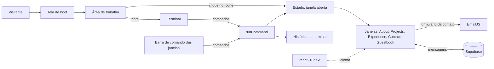

# 💻 Leonardo Pettersen | Portfólio Profissional

> Portfólio profissional em formato de **sistema operacional no navegador**: o visitante "liga" o computador, abre o terminal e explora as seções digitando comandos ou clicando nos ícones da área de trabalho.


🚧 **Status:** Sprint 02 concluída (funcionalidades principais). Deploy e ajustes finais na Sprint 03.

---

## 📚 Índice

- [Links Úteis](#-links-úteis)
- [Sobre o Projeto](#-sobre-o-projeto)
- [Como usar o site](#️-como-usar-o-site)
- [Funcionalidades Principais](#-funcionalidades-principais)
- [Tecnologias Utilizadas](#-tecnologias-utilizadas)
- [Arquitetura](#-arquitetura)
- [Instalação e Execução](#-instalação-e-execução)
- [Banco de Dados (Guestbook)](#️-banco-de-dados-guestbook)
- [Deploy](#-deploy)
- [Estrutura de Pastas](#-estrutura-de-pastas)
- [Protótipos](#-protótipos)
- [Demonstração](#-demonstração)
- [Documentações utilizadas](#-documentações-utilizadas)
- [Autor](#-autor)
- [Agradecimentos](#-agradecimentos)
- [Licença](#-licença)

---

## 🔗 Links Úteis

* 🌐 **Site publicado:** _em breve (será adicionado após o deploy)_
* 🎨 **Protótipos no Figma:** [Wireframe Portfólio](https://www.figma.com/design/RagNM3PaJglaInWaZBa3Uk/Wireframe-Portif%C3%B3lio?node-id=0-1&t=LONNOAM8aQx4MY8Z-1)
* 📦 **Repositório:** [leopettersen/portifolio](https://github.com/leopettersen/portifolio)

---

## 📝 Sobre o Projeto

Este projeto é o meu portfólio profissional: um site onde reúno minha trajetória, projetos, experiências e formas de contato em um só lugar. Foi desenvolvido como o **Laboratório 01** da disciplina de Desenvolvimento e Integração de Aplicações Web (DIAW), do curso de Engenharia de Software da PUC Minas, e continua como meu portfólio de fato depois da entrega.

Em vez de um site tradicional com menu e rolagem, a interface imita um **sistema operacional**. O site abre com uma tela de inicialização (boot) e chega a uma área de trabalho com um único atalho: o terminal. Ao abrir o terminal, os demais ícones aparecem. A partir daí, o visitante explora o conteúdo de dois jeitos: digitando comandos (`about`, `projects`, `experience`, `contact`) ou clicando nos ícones. Cada seção abre em uma janela que pode ser arrastada, maximizada e fechada.

A ideia é que quem chega entenda em poucos segundos quem eu sou, veja meus projetos e experiências e consiga entrar em contato. O site é bilíngue (português e inglês), responsivo (celular, tablet e computador) e tem um **guestbook**, onde qualquer pessoa pode deixar uma mensagem pública.

O site é aberto a qualquer pessoa, sem cadastro nem login. Por isso o foco está em ser claro, rápido de navegar e fácil de contatar.

---

## 🕹️ Como usar o site

1. **Ligue o sistema:** a tela de inicialização aparece sozinha. Para pular, aperte qualquer tecla ou toque na tela.
2. **Abra o terminal:** clique no ícone `terminal` da área de trabalho. Os demais ícones aparecem.
3. **Navegue:** clique nos ícones, nos atalhos do terminal ou digite um comando e aperte Enter.
4. **Troque o idioma** (PT/EN) na barra superior. A escolha fica salva no navegador.

| Comando | O que faz |
| :--- | :--- |
| `about` | Abre a janela **Sobre Mim** |
| `projects` | Abre a linha do tempo de **Projetos** |
| `experience` | Abre as **Experiências** |
| `contact` | Abre os **Contatos** e o formulário de mensagem |
| `guestbook` | Abre o **Guestbook** (comando escondido: só aparece no `help`) |
| `help` | Lista os comandos disponíveis |
| `clear` | Limpa o histórico do terminal |
| `close` | Fecha a janela aberta |

A barra de comando no rodapé das janelas aceita os mesmos comandos, então dá para trocar de seção sem voltar ao terminal.

No celular, os ícones ficam em uma grade, as janelas ocupam a tela inteira e o botão **Voltar** fecha a janela.

---

## ✨ Funcionalidades Principais

- 🖥️ **Tela de inicialização (boot):** simula a partida de um sistema operacional, em poucos segundos e com opção de pular.
- 🪟 **Área de trabalho interativa:** ícones e janelas arrastáveis no computador; janelas com botões de fechar, minimizar e maximizar.
- ⌨️ **Terminal com comandos:** histórico, atalhos clicáveis e os comandos listados acima, também disponíveis na barra de comando de cada janela.
- 🌐 **Bilíngue (PT/EN):** interface e conteúdos nos dois idiomas, com o idioma escolhido lembrado pelo navegador (o primeiro acesso é sempre em português).
- 👤 **Sobre Mim:** apresentação, formação, interesses e objetivos profissionais.
- 🕒 **Projetos em linha do tempo:** do mais antigo ao mais recente, com descrição, tecnologias, link do GitHub e imagem ou GIF.
- 💼 **Experiências:** organização, cargo, período, modelo de trabalho, descrição e habilidades.
- 📨 **Contato:** ícones clicáveis (e-mail, WhatsApp, LinkedIn e GitHub) e formulário com validação, enviado por e-mail via EmailJS.
- 💬 **Guestbook:** mensagens públicas armazenadas no Supabase, com botão "carregar mais", intervalo mínimo entre envios e campo-isca contra robôs.
- 📱 **Responsivo:** layout adaptado a celular, tablet e computador.

---

## 🛠 Tecnologias Utilizadas

### 💻 Front-end

* **Biblioteca:** [React](https://react.dev/)
* **Linguagem:** [TypeScript](https://www.typescriptlang.org/)
* **Build Tool:** [Vite](https://vite.dev/)
* **Estilização:** [Tailwind CSS](https://tailwindcss.com/)
* **Ícones:** [Lucide](https://lucide.dev/)
* **Internacionalização (PT/EN):** [i18next](https://www.i18next.com/) e [react-i18next](https://react.i18next.com/)

### 🗄️ Dados e Serviços

O projeto não tem back-end próprio. Os serviços externos são:

* **Banco de dados (guestbook):** [Supabase](https://supabase.com/)
* **Envio de e-mail (formulário de contato):** [EmailJS](https://www.emailjs.com/)

### ⚙️ Infraestrutura e Ferramentas

* **Containerização (execução local):** [Docker](https://www.docker.com/) e Docker Compose
* **Hospedagem:** [Vercel](https://vercel.com/)
* **Análise estática:** [oxlint](https://oxc.rs/docs/guide/usage/linter)
* **Protótipos:** [Figma](https://www.figma.com/)
* **Versionamento:** [Git](https://git-scm.com/) e [GitHub](https://github.com/)

### 📦 Dependências do projeto

Versões conforme o `app/package.json`.

| Pacote | Versão | Para que serve |
| :--- | :--- | :--- |
| `react`, `react-dom` | ^19.2.8 | Biblioteca de interface |
| `tailwindcss`, `@tailwindcss/vite` | ^4.3.3 | Estilização por classes utilitárias |
| `i18next` | ^26.4.2 | Motor de internacionalização |
| `react-i18next` | ^17.0.15 | Integração do i18next com o React |
| `i18next-browser-languagedetector` | ^8.2.1 | Lembra o idioma escolhido no navegador |
| `@supabase/supabase-js` | ^2.117.2 | Cliente do Supabase (guestbook) |
| `@emailjs/browser` | ^5.0.2 | Envio de e-mail do formulário de contato |
| `lucide-react` | ^1.49.0 | Ícones |

**Desenvolvimento:** `typescript` (~6.0.2), `vite` (^8.3.0), `@vitejs/plugin-react` (^6.1.1), `oxlint` (^1.81.0), `@types/react`, `@types/react-dom` e `@types/node`.

---

## 🏗 Arquitetura

### Visão geral

O projeto é uma **SPA (Single Page Application)** em React e TypeScript, construída com Vite e publicada na Vercel. Não há back-end próprio: os dois recursos que dependem de serviço externo, o guestbook e o envio de e-mail, são chamados diretamente pelo front-end, usando Supabase e EmailJS.

### Principais componentes

- **`App`:** mostra a tela de boot e, depois dela, a área de trabalho.
- **`DesktopLayout`:** dono do estado da interface. Guarda qual janela está aberta, se os ícones já foram liberados, o histórico do terminal e a função que executa os comandos.
- **`DesktopIcon`:** ícone da área de trabalho, arrastável.
- **`Window`:** janela padrão, com barra de título arrastável, botões de fechar, minimizar e maximizar e barra de comando no rodapé.
- **`Terminal` e `CommandPrompt`:** o terminal mostra apresentação, atalhos e histórico; o `CommandPrompt` é a linha de comando, compartilhada entre o terminal e o rodapé das janelas.
- **`pages/`:** o conteúdo de cada janela (About, Projects, Experience, Contact e Guestbook).
- **`data/`:** os conteúdos fixos (sobre, projetos, experiências, contatos e a lista de seções).
- **`services/`:** o acesso ao Supabase e as funções do guestbook.
- **`i18n/`:** configuração do i18next e os textos da interface em português e inglês.

### Fluxo de navegação

Não há roteamento por URL: o site inteiro vive em uma única tela, e a navegação é controlada por um **estado local do React** no `DesktopLayout`, que guarda qual janela está aberta (o terminal, uma seção ou nenhuma).

Ícones, atalhos e comandos não têm lógicas separadas: todos terminam em **uma função só** (`runCommand`), que atualiza esse estado. Digitar `projects` no terminal, digitar no rodapé de uma janela ou clicar no ícone tem o mesmo efeito. O `help`, o `clear` e os comandos desconhecidos escrevem no histórico do terminal, que também mora no `DesktopLayout` e por isso não se perde quando uma janela abre e fecha.

A lista de seções (usada nos ícones e nos comandos) fica centralizada em `data/sections.ts`, de modo que adicionar uma seção nova significa registrá-la nesse arquivo, nos tipos do projeto e no mapa de páginas do `DesktopLayout`.

### Idioma

O `react-i18next` guarda o idioma atual e a escolha do visitante no navegador. Ele traduz os textos da interface (rótulos, botões, mensagens do terminal e do formulário). Os conteúdos longos (sobre, experiências e projetos) ficam nos arquivos de `data/`, com um campo para cada idioma: o TypeScript obriga a preencher os dois, e um conteúdo sem tradução não compila.

### Decisões arquiteturais

- **Sem back-end próprio:** o site só precisa de um banco para o guestbook e de envio de e-mail, e ambos são cobertos por serviços prontos.
- **Navegação por estado local, sem biblioteca de rotas:** o site é uma tela única com janelas, então não há páginas distintas que justifiquem um roteador. Isso mantém o projeto mais simples e com menos dependências.
- **Conteúdo fixo no código:** projetos e experiências mudam pouco, então ficam versionados junto ao projeto, sem depender de banco.
- **Comandos em inglês, interface traduzida:** os comandos (`about`, `help`...) são o mesmo nos dois idiomas, e só os textos mudam.
- **Segurança do guestbook no banco:** as regras de acesso (RLS) e os limites de tamanho valem no próprio Supabase, e não só no navegador. Como a chave pública do Supabase fica no código do cliente por natureza, a proteção vem dessas regras.
- **Chaves públicas no front-end:** só variáveis `VITE_*` públicas entram no projeto. Chaves secretas (como a `service_role` do Supabase e a chave privada do EmailJS) nunca são usadas.
- **Docker só para execução local:** a Vercel faz o build e o deploy do site sem containers.
- **Boot curto e pulável:** a tela de inicialização reforça o conceito, mas não atrasa quem tem pressa.
- **Celular sem arrastar:** arrastar com o dedo conflita com a rolagem, então no celular os ícones são fixos e as janelas ocupam a tela inteira.

### Trade-offs

- Como não há rotas, cada seção não tem URL própria: não é possível compartilhar um link direto para Projects, e o botão voltar do navegador não fecha janelas.
- Atualizar um projeto ou experiência exige um novo deploy.
- A moderação do guestbook é manual (apagar linhas no painel do Supabase). O intervalo entre envios e o campo-isca desanimam o abuso casual, mas quem chamar a API diretamente os contorna.
- Só uma janela fica aberta por vez, e as posições de janelas e ícones não são salvas entre visitas.
- Os conteúdos traduzidos ficam duplicados nos dados (um campo por idioma).

### Diagrama



---

## 🔧 Instalação e Execução

### Pré-requisitos

* **Git**
* **Node.js 22 (LTS)** para rodar sem Docker, ou **Docker** com **Docker Compose** para rodar em contêiner
* Contas gratuitas no **Supabase** e no **EmailJS**, para obter as chaves usadas nas variáveis de ambiente

### 📦 Instalação

```bash
git clone https://github.com/leopettersen/portifolio.git
cd portifolio
```

### 🔑 Variáveis de Ambiente

O projeto fica na pasta `app/`. A partir da raiz do repositório, copie o arquivo de exemplo e preencha com os seus valores:

```bash
cp app/.env.example app/.env
```

| Variável | Descrição |
| :--- | :--- |
| `VITE_SUPABASE_URL` | URL do projeto no Supabase. |
| `VITE_SUPABASE_ANON_KEY` | Chave pública do Supabase (a *publishable key* ou a chave `anon`). |
| `VITE_EMAILJS_SERVICE_ID` | ID do serviço de e-mail no EmailJS. |
| `VITE_EMAILJS_TEMPLATE_ID` | ID do template de e-mail no EmailJS. |
| `VITE_EMAILJS_PUBLIC_KEY` | Chave pública do EmailJS. |

> [!IMPORTANT]
> O arquivo `.env` não é versionado. Use apenas chaves **públicas** nas variáveis `VITE_*`, porque o Vite as inclui no código entregue ao navegador. **Nunca** use a `service_role` do Supabase nem a chave privada do EmailJS.

O template do EmailJS deve usar as variáveis `{{name}}`, `{{email}}` e `{{message}}`, e o campo *Reply To* deve apontar para `{{email}}`.

### ⚡ Como Executar

**Com Docker (a partir da raiz do repositório):**

```bash
docker compose up --build
```

O site ficará disponível em **http://localhost:5173**, com recarga automática ao editar o código. Para parar:

```bash
docker compose down
```

Observações sobre o Docker:

- O `app/.env` é espelhado para dentro do contêiner e **não** é gravado na imagem. Depois de alterá-lo, rode `docker compose restart`.
- Depois de instalar uma dependência nova, rode `docker compose up --build --renew-anon-volumes`, para o contêiner usar os `node_modules` atualizados.
- No Windows e no macOS, se a página não recarregar ao editar arquivos, ative a opção `server.watch.usePolling` em `app/vite.config.ts`.

**Sem Docker:**

```bash
cd app
npm install
npm run dev
```

### 📜 Scripts disponíveis

Todos os comandos rodam dentro de `app/`.

| Comando | O que faz |
| :--- | :--- |
| `npm run dev` | Inicia o servidor de desenvolvimento do Vite |
| `npm run build` | Verifica os tipos (`tsc -b`) e gera a versão de produção em `dist/` |
| `npm run preview` | Serve localmente a versão gerada pelo build |
| `npm run lint` | Executa a análise estática com o oxlint |

O projeto não tem testes automatizados. A verificação de tipos acontece no `npm run build` (ou, para uma checagem rápida, com `npx tsc -b`).

---

## 🗄️ Banco de Dados (Guestbook)

O guestbook usa uma única tabela no Supabase. Para criá-la, abra o **SQL Editor** do seu projeto e execute:

```sql
create table public.guestbook_messages (
  id bigint generated always as identity primary key,
  name text not null check (char_length(btrim(name)) between 1 and 40),
  message text not null check (char_length(btrim(message)) between 1 and 500),
  created_at timestamptz not null default now()
);

alter table public.guestbook_messages enable row level security;

create policy "Leitura pública do guestbook"
  on public.guestbook_messages for select
  to anon
  using (true);

create policy "Envio público ao guestbook"
  on public.guestbook_messages for insert
  to anon
  with check (
    char_length(btrim(name)) between 1 and 40
    and char_length(btrim(message)) between 1 and 500
  );

grant select, insert on public.guestbook_messages to anon;
```

O que isso garante:

- **Limites no banco:** nome de 1 a 40 caracteres e mensagem de 1 a 500, mesmo para quem ignorar o site e chamar a API direto.
- **Só leitura e envio:** o visitante (papel `anon`) consegue ler e inserir, mas **não existe** política de edição nem de remoção, então ninguém altera ou apaga mensagens pela chave pública.
- **Moderação manual:** mensagens inadequadas são removidas pelo **Table Editor** do Supabase.

Depois, copie a **URL do projeto** e a **chave pública** em *Project Settings* para o `app/.env`.

---

## 🚀 Deploy

> [!NOTE]
> O deploy está previsto para a Sprint 03. O link do site será adicionado em [Links Úteis](#-links-úteis) assim que estiver no ar.

O site é publicado na **Vercel**, conectada ao repositório do GitHub. Cada atualização na branch principal gera um novo deploy automaticamente.

Configuração do projeto na Vercel:

| Campo | Valor |
| :--- | :--- |
| Framework Preset | Vite |
| Root Directory | `app` |
| Build Command | `npm run build` |
| Output Directory | `dist` |

As cinco variáveis `VITE_*` (listadas em [Variáveis de Ambiente](#-variáveis-de-ambiente)) devem ser cadastradas em *Project Settings > Environment Variables* antes do build. Como o build executa `tsc -b`, qualquer erro de tipo interrompe o deploy.

---

## 📂 Estrutura de Pastas

```
portifolio/
├── docs/
│   └── images/
│       ├── wireframes/              # Protótipos das telas (Figma)
│       └── screenshots/             # Capturas do site em funcionamento
├── app/                             # Aplicação (projeto Vite)
│   ├── public/                      # Arquivos estáticos servidos como estão
│   ├── src/
│   │   ├── assets/                  # Imagens usadas no site
│   │   ├── components/
│   │   │   ├── boot/                # Tela de inicialização (BootScreen)
│   │   │   ├── desktop/             # Layout da área de trabalho, ícones, barra superior e relógio
│   │   │   ├── terminal/            # Terminal e linha de comando (CommandPrompt)
│   │   │   ├── ui/                  # Peças reutilizáveis (Tag)
│   │   │   └── window/              # Janela padrão (arrastar, minimizar, maximizar, fechar)
│   │   ├── data/                    # Conteúdos fixos: sobre, projetos, experiências, contatos, seções e apps
│   │   ├── hooks/                   # Hooks personalizados (useDraggable)
│   │   ├── i18n/                    # Configuração do i18next e traduções (pt e en)
│   │   ├── pages/                   # Conteúdo de cada janela (About, Projects, Experience, Contact, Guestbook)
│   │   ├── services/                # Cliente do Supabase e funções do guestbook
│   │   ├── types/                   # Tipos TypeScript
│   │   ├── App.tsx                  # Componente raiz (boot e área de trabalho)
│   │   ├── main.tsx                 # Ponto de entrada da aplicação
│   │   └── index.css                # Importação do Tailwind
│   ├── .dockerignore                # Arquivos que não entram na imagem Docker
│   ├── .env.example                 # Modelo das variáveis de ambiente (sem valores reais)
│   ├── Dockerfile                   # Imagem do ambiente de desenvolvimento
│   ├── index.html                   # HTML base da aplicação
│   ├── package.json                 # Dependências e scripts
│   └── vite.config.ts               # Configuração do Vite
├── .gitignore                       # Arquivos ignorados pelo Git (.env, node_modules etc.)
├── docker-compose.yml               # Execução local com Docker
├── LICENSE                          # Licença do projeto
└── README.md                        # Documentação principal
```

---

## 🎨 Protótipos

Os wireframes de média fidelidade foram feitos no [Figma](https://www.figma.com/design/RagNM3PaJglaInWaZBa3Uk/Wireframe-Portif%C3%B3lio?node-id=0-1&t=LONNOAM8aQx4MY8Z-1) e guiaram o layout das janelas e das páginas.

| Home (desktop) | Sobre Mim |
| :---: | :---: |
| .png) |  |

| Projetos | Experiências |
| :---: | :---: |
|  |  |

| Contato | Mobile |
| :---: | :---: |
|  | .png)  |

---

## 🎥 Demonstração

### 🖥️ Desktop

| Tela de boot | Área de trabalho |
| :---: | :---: |
|  |  |

| Terminal | Sobre Mim |
| :---: | :---: |
|  |  |

| Projetos | Experiências |
| :---: | :---: |
|  |  |

| Contato | Guestbook |
| :---: | :---: |
|  |  |

### 📱 Mobile

| Terminal | Projetos |
| :---: | :---: |
|  |  |

---

## 🔗 Documentações utilizadas

* 📖 [React](https://react.dev/)
* 📖 [Vite](https://vite.dev/guide/)
* 📖 [TypeScript](https://www.typescriptlang.org/docs/)
* 📖 [Tailwind CSS](https://tailwindcss.com/docs)
* 📖 [i18next](https://www.i18next.com/) e [react-i18next](https://react.i18next.com/)
* 📖 [Supabase](https://supabase.com/docs)
* 📖 [EmailJS](https://www.emailjs.com/docs/)
* 📖 [Lucide](https://lucide.dev/guide/packages/lucide-react)
* 📖 [Docker](https://docs.docker.com/)
* 📖 [Vercel](https://vercel.com/docs)

---

## 👥 Autor

| 👤 Nome | GitHub | LinkedIn | E-mail |
| :--- | :--- | :--- | :--- |
| Leonardo Pettersen | [leopettersen](https://github.com/leopettersen) | [LinkedIn](https://www.linkedin.com/in/leonardopettersen) | [E-mail](mailto:leonardopettersen465@yahoo.com) |

---

## 🙏 Agradecimentos

* [**Engenharia de Software PUC Minas**](https://www.instagram.com/engsoftwarepucminas/?hl=pt) - Pelo apoio institucional e pela estrutura acadêmica.
* [**Prof. Dr. João Paulo Aramuni**](https://github.com/joaopauloaramuni) - Pela orientação na disciplina de Desenvolvimento e Integração de Aplicações Web.

---

## 📄 Licença

Este projeto é distribuído sob a [Licença MIT](./LICENSE).
